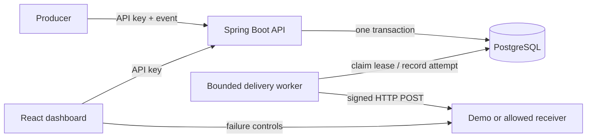
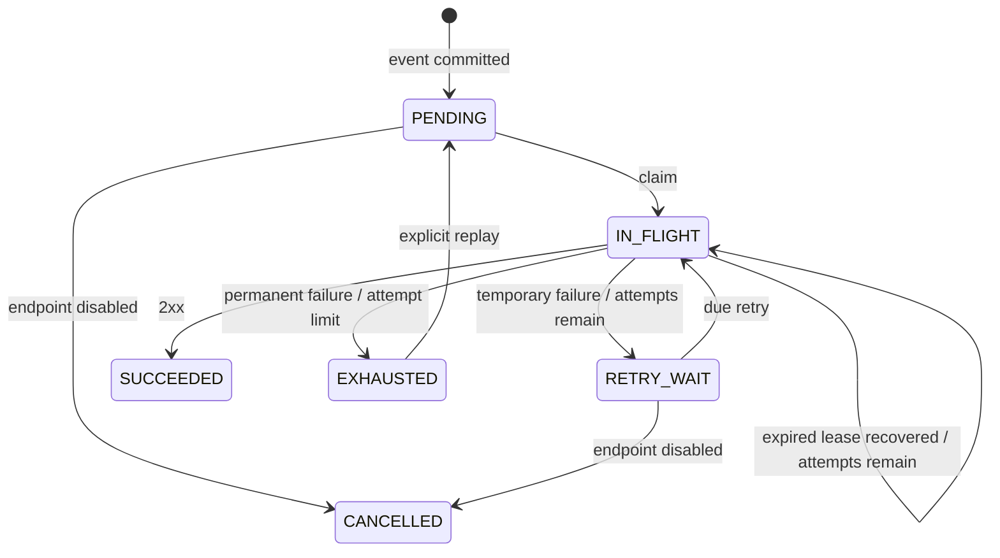

# Architecture and delivery guarantees

Relay is a single-operator webhook delivery service. One Spring Boot process hosts both the HTTP API and a bounded background worker. PostgreSQL owns durable state and queue coordination. No external message broker is required.

## Request and delivery paths

Controller → service → JDBC repository separates HTTP concerns, acceptance decisions and persistence. Delivery claims and completions use separate short transactions. Network I/O runs outside database transactions.

## Schema

- `webhook_endpoints`: destination, signing secret, enabled flag and registration timestamp.
- `webhook_events`: immutable producer event ID, endpoint, type, JSONB payload and acceptance timestamp.
- `delivery_jobs`: one job per event, current state, retry timing, lease token, lease expiry and counters.
- `delivery_attempts`: append-only attempt identity/number with completion outcome, HTTP status and elapsed time. An interrupted attempt is marked as unknown when its lease is recovered.

V1 creates endpoints; V2 creates events and the queue. Keep applied migrations immutable. Add V3 for future schema changes.

## Durable acceptance and idempotency

The event and its job commit in the same transaction before the controller returns 202. A job insert failure rolls back the event. A primary key on the producer's event ID and a unique event reference on jobs arbitrate concurrent submissions.

The first submission returns 202. An identical repeat returns 200 and the original delivery ID; it creates no extra job. Changing endpoint, type or payload returns 409. Payload equality follows PostgreSQL JSONB semantics: object property order and insignificant numeric formatting do not matter; array order does. Repeated identical events can still be retrieved after endpoint disable.

Event IDs are scoped to this single-operator service, not a tenant. Use 1–128 ASCII letters, digits, periods, underscores, colons or hyphens. IDs are also carried in an HTTP header. Event types are nonblank strings up to 128 characters; payloads must be JSON objects. The API limits request bodies to 64 KiB and rejects values PostgreSQL cannot represent, including NUL characters.

## Leases and crash recovery

Workers select due jobs using `FOR UPDATE SKIP LOCKED`. In the claim transaction they assign a fresh UUID lease token, increment counters and insert an attempt. A semaphore reserves capacity before claiming: each process can have at most its configured concurrency in progress and does not accumulate an unbounded claimed backlog.

The default lease is 30 seconds; the whole HTTP request/response deadline is 3 seconds. Configuration requires a lease at least twice the request deadline. No lease renewal is needed for these deliberately bounded requests.

Completion updates the job only if its token still matches and the lease has not expired. A stale worker cannot overwrite a newer claim or result. A crashed process leaves an expiring lease; the next worker marks the interrupted attempt's outcome unknown and retries if the cycle has attempts left. If the last permitted attempt crashes, the job becomes exhausted after expiry.

A lease cannot prevent duplicate effects at the receiver. A request may be delivered before the process crashes or its response times out. The receiver must deduplicate effects using the stable event ID. Ordering is not promised.

## Retry and replay policy

- Every 2xx acknowledges delivery; it does not prove downstream business processing completed.
- Network errors/timeouts, 408, 425, 429 and 5xx are retryable.
- Other responses, including redirects, exhaust immediately. Redirects are never followed.
- Default maximum: 5 attempts per cycle. Delay uses exponential backoff with equal jitter, starting with a 0.5–1 second range and capped at 60 seconds. Retry-After is not currently interpreted.
- Only exhausted jobs may be replayed and only while their endpoint remains enabled. Replay preserves event ID, payload, delivery ID and all attempts, resets the per-cycle counter, and increments the replay counter.
- Disabling rejects new events and cancels pending/retry jobs as the worker encounters them. Already claimed requests may finish. Disabled endpoints cannot be re-enabled in this MVP.
- Terminal jobs and attempts remain stored; no automatic retention deletion runs.

## Signing

Each registration receives a random 32-byte secret encoded as base64url text. That exact text's UTF-8 bytes form the HMAC key.

The request body is a JSON envelope containing `id`, `type`, `createdAt` and `payload`. For every attempt Relay supplies:

- `X-Relay-Event-Id`: stable producer ID.
- `X-Relay-Timestamp`: Unix seconds.
- `X-Relay-Signature`: `v1=` followed by the lowercase hex HMAC-SHA256 of timestamp, a period, and the exact body bytes.

Verification must use the raw body, constant-time comparison, and a timestamp tolerance. See [the runnable receiver](../receiver/README.md). Its deduplication store is in memory for the demo and is cleared on reset/restart; production receivers need durable deduplication in the same transaction as their business effect.

## Security boundary and operational limits

All application routes require `X-API-Key` except the minimal health endpoint. The dashboard stores the operator key in sessionStorage for the current tab and sends it in headers. Endpoint secrets are returned only at registration, omitted from lists/history, and never intentionally logged. They are stored in plaintext in PostgreSQL for this local MVP; deploy with protected database storage/backups and add application-level encryption/key rotation before exposing sensitive production secrets.

Destination registration is restricted to an exact hostname allowlist. HTTP is enabled for the local receiver; use HTTPS for remote endpoints. This is a trusted-operator allowlist, not a complete public SSRF/abuse defense: trusted DNS, egress policy, rate limits, tenant isolation and TLS termination are required for a public service. Defaults bind all published Docker ports to loopback and use clearly documented local demo credentials.

The queue is durable but the fixed worker pool is per process. More processes can safely share the database, increasing total concurrency; endpoint rate limits/fairness quotas and retention policies are outside this MVP. Lists return the most recent 100 records by default, configurable up to 500; full cursor pagination is a future extension.

## Observability

`/actuator/health` checks application/database health without details. Authenticated `/actuator/metrics` includes:
- `relay.events.accepted` and `relay.events.duplicates` (incremented after commit).
- `relay.delivery.attempts` tagged by outcome.
- `relay.delivery.duration`, `relay.delivery.stale_completions`, and `relay.worker.active`.
- Spring HTTP, JDBC pool and JVM metrics.

Delivery logs contain job ID, attempt number, outcome, HTTP status and duration. Payloads, URLs, API keys, response bodies and signing secrets are excluded. Metrics are process-local and reset on restart; PostgreSQL attempt history is the durable record.
